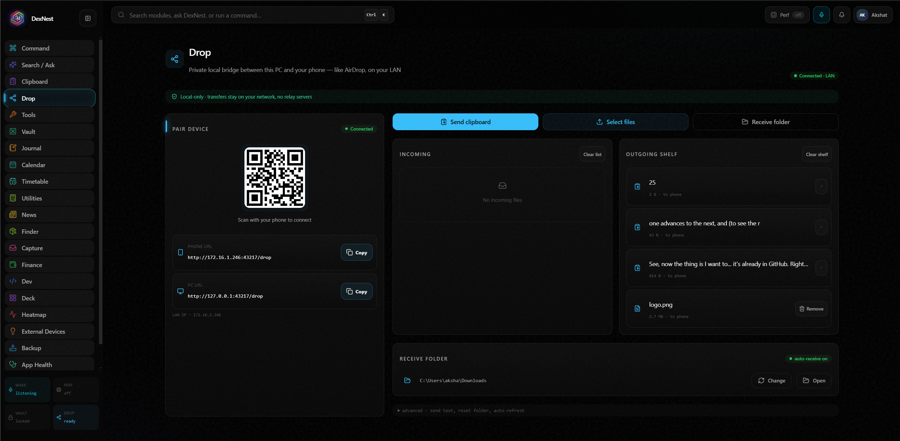

<div align="center">

# DexNest

**An offline-first personal command center for Windows.**
No cloud. No accounts. No telemetry. Your data stays in one local folder you control.


</div>

> DexNest is a single desktop app that pulls the small tools you use every day —
> quick commands, phone↔PC file drop, finance tracking, calendar, a secure vault,
> clipboard history, a Stream Deck bridge, and optional local voice control — into
> one keyboard-driven hub that runs entirely on your machine.

<!-- Replace these with real screenshots / a short GIF. This is the single biggest thing for GitHub + LinkedIn reach. -->
<!--
<div align="center">
  
  
</div>
-->

---

## Why DexNest

- **Offline-first & private.** Everything runs locally. No login, no external APIs, no analytics. All real data lives under a single `local-data/` folder.
- **One shell, many modules.** Instead of ten browser tabs and utilities, it's one app with a fast command palette.
- **Yours to change.** Open source under MIT — read it, fork it, wire in your own modules.

## Features

- **Command home** — global hotkey palette to run any action fast.
- **Drop** — AirDrop-style local bridge between this PC and your phone over Wi-Fi (scan a QR, send text/files both ways). No relay servers.
- **Finance** — local expense tracking with profiles (personal/business), receipts, recurring expenses, and a period dashboard (day / month / quarter / year / all-time / custom range).
- **Calendar** — events with real recurrence (daily/weekly/monthly/yearly), color tags, and lead-time reminders.
- **Vault & OCR** — a local document vault with optional on-device OCR and an encrypted secure vault.
- **Clipboard** — searchable local clipboard history and snippets.
- **Stream Deck bridge** — control DexNest from an Elgato Stream Deck via a localhost endpoint.
- **Voice (optional)** — local wake word ("Hey Jarvis") and speech-to-text using on-device models. See [Optional: local voice](#optional-local-voice).
- **More** — Dev dashboard, Heatmap, Journal, Finder, Capture, Weather, News, reminders/nudges.

## Download & run (no build required)

1. Go to the [**Releases**](../../releases) page.
2. Download the latest `DexNest-Setup-x.y.z.exe`.
3. Run it. Windows SmartScreen may warn "unknown publisher" because the installer is **not code-signed** — click **More info → Run anyway**. (Code signing is a paid certificate; contributions welcome.)

On first launch DexNest stores its data under `<install folder>/local-data` (never in AppData). See [Data & privacy](#data--privacy) to change this.

## Build from source

### Prerequisites

- **Node.js 20+**
- **pnpm** via Corepack (bundled with Node): `corepack enable`
- **Windows build tools** for the native `better-sqlite3` module — install the "Desktop development with C++" workload (Visual Studio Build Tools) and Python 3 (used by node-gyp). On most dev machines these are already present.

### Steps

```bash
corepack pnpm install          # install workspace deps
corepack pnpm dev              # run the app in dev (Vite + Electron)
```

Other useful commands:

```bash
corepack pnpm typecheck        # type-check the whole monorepo
corepack pnpm build            # build main + renderer bundles
corepack pnpm rebuild:native   # rebuild better-sqlite3 for Electron (if native errors)
```

### Package a Windows installer yourself

```bash
corepack pnpm -C apps/desktop package:win:installer
```

The installer is written to `apps/desktop/release/`. Do not commit `release/` or `local-data/`.

## Optional: local voice

The core app runs without any of this. The **wake word and dictation** features are optional and need a local Python environment (they are not bundled in the installer):

1. Install **Python 3.12**.
2. Create a venv and install the sidecar dependencies:

```bash
python -m venv sidecars/speech/.venv
sidecars/speech/.venv/Scripts/python -m pip install openwakeword sounddevice numpy faster-whisper
```

3. In DexNest → **Settings → Ambient Voice / Wake**, enable wake word. The Diagnostics panel there shows the resolved Python path, mic level, and detection score to help you verify it.

Without this, everything except voice works normally.

## Data & privacy

DexNest keeps **all** real user data in one place and never writes to Windows AppData:

```
local-data/
  data/        SQLite database
  files/       documents, receipts, drop, captures, vault
  backups/     local backup zips
  index/       rebuildable search index
  settings/    JSON settings
```

**Where it lives** (resolved in this order):

1. `DEXNEST_DATA_ROOT` environment variable, if set.
2. `D:\DeskNest\local-data`, if that folder already exists (the author's convention — harmless to ignore).
3. `<app install folder>/local-data` (the default for a fresh install).

Set `DEXNEST_DATA_ROOT` to put your data anywhere you like. There is no cloud sync and no telemetry — nothing leaves your machine.

Backup/restore lives in **Settings → Data Management** (local zip files under `local-data/backups`).

## Architecture

DexNest is a pnpm monorepo:

```
apps/desktop        Electron main process + React renderer (the shell)
packages/           shared libraries (action registry, local db, shared types/ui)
modules/            feature modules (drop, dev, deck, command, clipboard, …)
sidecars/           optional Python sidecars (speech, wake word)
docs/               architecture and design docs
```

Every module registers actions into a shared **action registry** and writes metadata-only events to a local **audit log**. See [`docs/`](docs/) for the architecture rules, design tokens, and action/event contracts.

A local HTTP action endpoint runs at:

```
POST http://127.0.0.1:43217/actions/:actionId
```

## Contributing

Contributions are welcome — see [CONTRIBUTING.md](CONTRIBUTING.md). In short: `corepack pnpm typecheck && corepack pnpm build` must pass, keep changes modular, and never commit `local-data/`.

## Status

DexNest is a personal project shared as-is. Expect rough edges; issues and PRs are welcome.

## License

[MIT](LICENSE) © Akshat978
