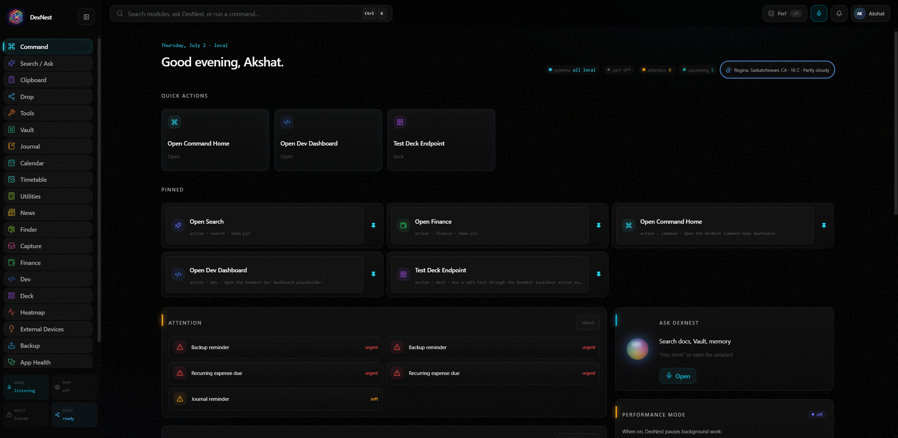

<div align="center">

# DexNest

**An offline-first personal command center for Windows.**
No cloud. No accounts. No telemetry. Your data stays in one local folder you control.


</div>

> DexNest pulls the small tools you use every day — quick commands, phone↔PC file
> drop, finance tracking, calendar, a secure vault, clipboard history, a Stream
> Deck bridge, and optional local voice control — into one keyboard-driven hub
> that runs entirely on your machine.

<!-- Replace with real screenshots / a short GIF — this is the biggest thing for GitHub + LinkedIn reach.
<div align="center">
  
</div>
-->

## Contents

- [Why DexNest](#why-dexnest)
- [Features](#features)
- [Install (download & run)](#install-download--run)
- [Build from source](#build-from-source)
- [Optional: local voice (wake word + dictation)](#optional-local-voice-wake-word--dictation)
- [Data & privacy](#data--privacy)
- [Configuration](#configuration)
- [Troubleshooting](#troubleshooting)
- [Architecture](#architecture)
- [Contributing](#contributing)
- [License](#license)

## Why DexNest

- **Offline-first & private.** Everything runs locally. No login, no external APIs, no analytics. All real data lives under a single `local-data/` folder.
- **One shell, many modules.** Instead of ten browser tabs and utilities, it's one app with a fast command palette.
- **Yours to change.** Open source under MIT — read it, fork it, wire in your own modules.

## Features

- **Command home** — global-hotkey palette to run any action fast.
- **Drop** — AirDrop-style local bridge between this PC and your phone over Wi-Fi (scan a QR, send text/files both ways). No relay servers.
- **Finance** — local expense tracking with profiles (personal/business), receipts, recurring expenses, and a period dashboard (day / month / quarter / year / all-time / custom range).
- **Calendar** — events with real recurrence (daily/weekly/monthly/yearly), color tags, and lead-time reminders.
- **Vault & OCR** — a local document vault with optional on-device OCR and an encrypted secure vault.
- **Clipboard** — searchable local clipboard history and snippets.
- **Stream Deck bridge** — control DexNest from an Elgato Stream Deck via a localhost endpoint.
- **Voice (optional)** — local wake word ("Hey Jarvis") and speech-to-text using on-device models. See [Optional: local voice](#optional-local-voice-wake-word--dictation).
- **More** — Dev dashboard, Heatmap, Journal, Finder, Capture, Weather, News, reminders/nudges.

## Install (download & run)

For most people — no build tools required:

1. Open the [**Releases**](../../releases) page.
2. Download the latest `DexNest-Setup-x.y.z.exe`.
3. Run it and follow the installer. You can choose the install folder.

**Windows SmartScreen note:** the installer is **not code-signed** (a signing certificate is paid), so Windows may show *"Windows protected your PC — unknown publisher."* Click **More info → Run anyway**. The source is fully open here if you'd rather build it yourself.

On first launch, DexNest creates its data folder next to the app and opens the command home. See [Data & privacy](#data--privacy) for where your data lives and how to move it.

> Voice features (wake word / dictation) are **not** included in the installer — they need a local Python setup. Everything else works out of the box. See [Optional: local voice](#optional-local-voice-wake-word--dictation).

## Build from source

### Prerequisites

| Requirement | Notes |
| --- | --- |
| **Node.js 20+** | [nodejs.org](https://nodejs.org) or `winget install OpenJS.NodeJS.LTS` |
| **pnpm** (via Corepack) | Bundled with Node — just run `corepack enable` once |
| **Git** | `winget install Git.Git` |
| **C++ build tools** | For the native `better-sqlite3` module. Install **Visual Studio Build Tools** with the *"Desktop development with C++"* workload (`winget install Microsoft.VisualStudio.2022.BuildTools`) plus Python 3 (used by node-gyp). Most dev machines already have these. |

### Steps

```bash
# 1. Clone
git clone https://github.com/Akshat978/DexNest.git
cd DexNest

# 2. Enable pnpm and install workspace dependencies
corepack enable
corepack pnpm install

# 3. Run the app in development (Vite dev server + Electron)
corepack pnpm dev
```

The app window opens automatically. Edits to the renderer hot-reload; edits to the
main process rebuild and relaunch.

### Other commands

```bash
corepack pnpm typecheck        # type-check the whole monorepo
corepack pnpm build            # build main + renderer production bundles
corepack pnpm rebuild:native   # rebuild better-sqlite3 for Electron (if you hit a native ABI error)
```

### Package a Windows installer yourself

```bash
corepack pnpm -C apps/desktop package:win:installer
```

The installer (`DexNest-Setup-x.y.z.exe`) is written to `apps/desktop/release/`.
Never commit `release/` or `local-data/`.

> Maintainers: pushing a tag like `v0.1.0` triggers the GitHub Actions workflow in
> [`.github/workflows/release.yml`](.github/workflows/release.yml), which builds the
> installer and attaches it to a draft GitHub Release automatically.

## Optional: local voice (wake word + dictation)

The core app runs without any of this. Wake word and dictation are **optional** and
need a local Python environment (not bundled in the installer):

1. Install **Python 3.12** (`winget install Python.Python.3.12`).
2. Create the speech sidecar virtual environment and install its dependencies:

   ```bash
   python -m venv sidecars/speech/.venv
   sidecars/speech/.venv/Scripts/python -m pip install --upgrade pip
   sidecars/speech/.venv/Scripts/python -m pip install openwakeword sounddevice numpy faster-whisper
   ```

3. In DexNest → **Settings → Ambient Voice / Wake**, enable **Wake word**. The first
   time a built-in phrase (e.g. *Hey Jarvis*) is used, its small model is cached
   locally.
4. Use the diagnostics on that page to verify it: they show the resolved **Python
   path**, live **mic level / score**, the selected mic, and the wake sidecar status.
   If the mic level stays near zero while you speak, raise the Windows input level
   for that mic or increase the **Wake input gain**.

Without this, everything except voice works normally.

## Data & privacy

DexNest keeps **all** real user data in one place and never writes to Windows AppData:

```
local-data/
  data/        SQLite database
  files/       documents, receipts, drop, captures, vault
  backups/     local backup zips
  index/       rebuildable search index
  settings/    JSON settings (including any local integration keys you add)
```

**No cloud sync, no telemetry — nothing leaves your machine.** Secrets you add in the
app (e.g. a Govee API key for light control) are stored only under
`local-data/settings/`, which is gitignored and never committed.

**Backup / restore** lives in **Settings → Data Management** (local zip files under
`local-data/backups`).

## Configuration

**Where your data lives** is resolved in this order:

1. The `DEXNEST_DATA_ROOT` environment variable, if set — put your data anywhere.
2. `D:\DeskNest\local-data`, if that folder already exists (the author's convention — harmless to ignore).
3. `<app install folder>/local-data` — the default for a fresh install.

To use a custom location, set `DEXNEST_DATA_ROOT` before launching, e.g. in PowerShell:

```powershell
$env:DEXNEST_DATA_ROOT = "E:\MyData\DexNest"
```

**Local action endpoint** (used by the Stream Deck bridge and automations):

```
POST http://127.0.0.1:43217/actions/:actionId
```

## Troubleshooting

- **SmartScreen "unknown publisher"** — expected for an unsigned installer. *More info → Run anyway*, or build from source.
- **`better-sqlite3` native / ABI error when building** — run `corepack pnpm rebuild:native`. Make sure the C++ build tools (above) are installed.
- **App won't start / "another instance is running"** — DexNest is single-instance and may be minimized to the tray. Check the system tray before relaunching.
- **Voice never triggers** — voice needs the [Python setup](#optional-local-voice-wake-word--dictation). Then check **Settings → Ambient Voice / Wake** diagnostics: confirm the mic level moves when you speak and the score rises toward the threshold.
- **Port 43217 already in use** — another process is holding the local action port; close it or restart.

## Architecture

DexNest is a pnpm monorepo:

```
apps/desktop        Electron main process + React renderer (the shell)
packages/           shared libraries (action registry, local db, shared types/ui)
modules/            feature modules (drop, dev, deck, command, clipboard, …)
sidecars/           optional Python sidecars (speech, wake word)
docs/               architecture and design docs
```

Every module registers actions into a shared **action registry** and writes
metadata-only events to a local **audit log**. See [`docs/`](docs/) for the
architecture rules, design tokens, and action/event contracts.

## Contributing

Contributions are welcome — see [CONTRIBUTING.md](CONTRIBUTING.md). In short:
`corepack pnpm typecheck && corepack pnpm build` must pass, keep changes modular,
and never commit `local-data/`.

## License

[MIT](LICENSE) © Akshat978
